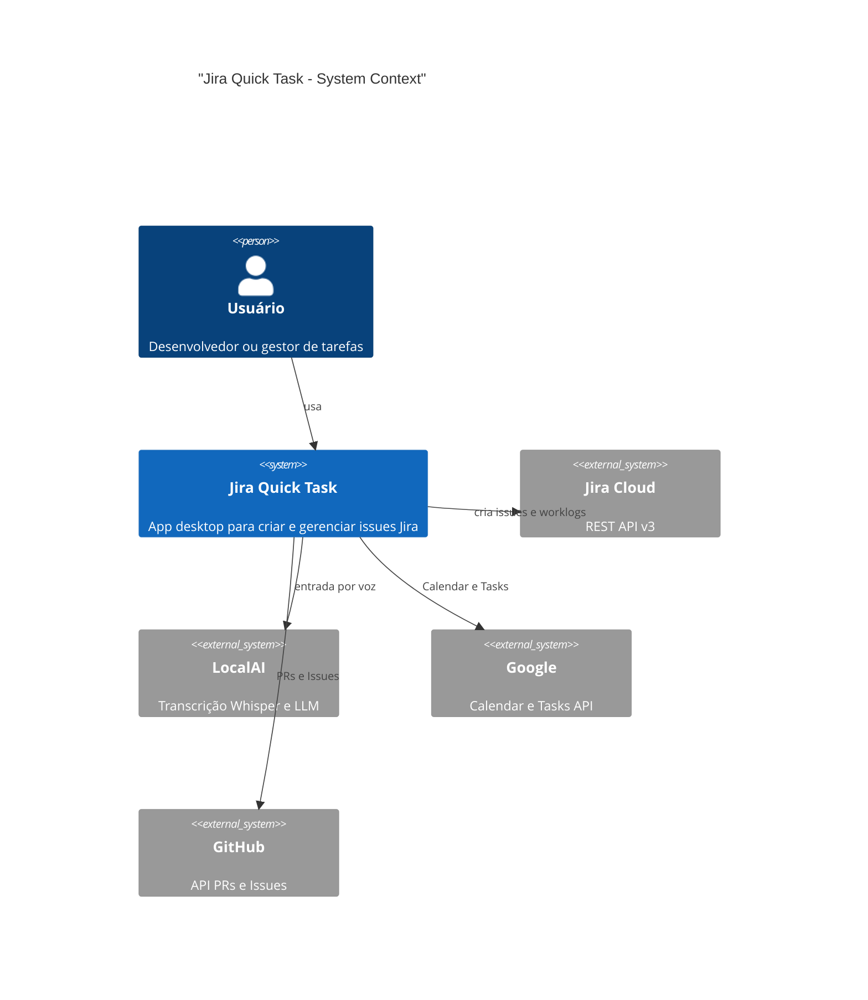

# Jira Quick Task

Aplicação desktop Kirigami 6 (KDE) para criar e gerenciar issues no Jira, worklogs, timer Pomodoro e integrações com Google e GitHub. Inclui entrada por voz via LocalAI (Whisper + LLM) para preencher campos do formulário.

## Features

- **Criar issues** — formulário com campos customizados, transição sequencial de status, worklog automático
- **Minhas Issues** — busca, detalhes, criar branch, iniciar timer
- **Timer Pomodoro** — painel flutuante com sessões e pausas configuráveis
- **Worklogs pendentes** — sincronização de worklogs retroativos
- **Google** — Calendar e Tasks; importar eventos/tarefas para Jira
- **GitHub** — PRs em review e issues atribuídas; importar para Jira
- **Entrada por voz** — gravação de áudio → LocalAI (Whisper + LLM) → preenchimento automático. Requer [LocalAI no host](docs/voice-input-setup.md)
- **Configuração** — via interface gráfica (sem edição manual de arquivos)

## Arquitetura



Stack: **PySide6/Qt6** + **Kirigami 6** (UI), **Jira REST API v3**, **Flatpak** (distribuição), **Docker** (desenvolvimento e testes).

## Desenvolvimento e empacotamento

| Objetivo | Comando |
|----------|---------|
| Construir imagem Docker | `make dev-build` |
| Executar testes | `make dev-test` |
| Shell no container | `make dev-shell` |
| Formatar código | `make dev-format` |
| Lint QML | `make qml-lint` |
| Instalar deps Flatpak | `make install-deps` |
| Build Flatpak | `make build` |
| Executar app | `make run` |
| Build + Run (dev) | `make dev` |
| Limpar build | `make clean-build` |

**Pré-requisitos:** Docker para dev/testes; Flatpak para executar a aplicação. Não é necessário instalar Python, Qt6 ou Kirigami no host.

## Ferramental

- **Docker** — ambiente unificado (Python 3.11+, PySide6, Qt6, KF6)
- **Flatpak** — distribuição e execução
- **pytest** — testes unitários
- **black** — formatação Python
- **qmllint** — validação QML
- **Cursor hooks** — validação automática ao editar (ver [.cursor/hooks/README.md](.cursor/hooks/README.md))

## Screenshots

| Tela | Arquivo |
|------|---------|
| Criar Issue | [criar-issue.png](docs/screenshots/criar-issue.png) |
| Criar por voz | [criar-issue-por-voz.png](docs/screenshots/criar-issue-por-voz.png) |
| Minhas Issues | [minhas-issues.png](docs/screenshots/minhas-issues.png) |
| Google (Calendar + Tasks) | [google-calendar-tasks.png](docs/screenshots/google-calendar-tasks.png) |
| GitHub (PRs + Issues) | [github-prs-issues.png](docs/screenshots/github-prs-issues.png) |
| Worklogs pendentes | [worklogs-pendentes.png](docs/screenshots/worklogs-pendentes.png) |
| Configurações | [configuracoes.png](docs/screenshots/configuracoes.png) |
| Timer Pomodoro | [timer-pomodoro.png](docs/screenshots/timer-pomodoro.png) |

## Configuração

**Localização dos arquivos:**
- **Flatpak:** `~/.var/app/org.kde.jira-quick-task/config/jira-quick-task/`
- **Local:** `~/.config/jira-quick-task/`

**Arquivos:** `config.json` (projeto, campos customizados, Pomodoro, voz) e `.jira-config.yml` (credenciais Jira).

Na primeira execução, a aplicação abre na aba **Configuração**. Preencha URL do Jira, email e token de API; clique em **Salvar**. O token pode ser obtido em [id.atlassian.com/manage-profile/security/api-tokens](https://id.atlassian.com/manage-profile/security/api-tokens).

Para entrada por voz: [Configurar entrada por voz (LocalAI)](docs/voice-input-setup.md).

## Debug

```bash
make run-debug
```

Ou: `flatpak run org.kde.jira-quick-task --debug`. Ver [DEBUG.md](DEBUG.md).

## Troubleshooting

| Problema | Solução |
|----------|---------|
| Configuração não encontrada | Abra Configuração, preencha URL/email/token, Salvar |
| PySide6/Kirigami não encontrado | Use Docker (`make dev-build`) ou Flatpak (`make build`) |
| Campos customizados vazios | Verifique IDs em `config.json`; use `GET /rest/api/3/field` no Jira |
| Erro ao transicionar status | Nome do status em `config.json` deve coincidir exatamente com o Jira |
| Worklog não registrado | Marque "Registrar worklog"; formato YYYY-MM-DD HH:MM:SS; só após transição para IN PROGRESS |
| Nome do space nas Google Tasks aparece só "Chat Space" | No projeto Google Cloud (onde criou o OAuth): [Chat API → Configuration](https://console.cloud.google.com/apis/api/chat.googleapis.com/hangouts-chat), preencha **App name**, **Avatar URL** e **Description** e guarde. Reabra a aba Google na app para carregar de novo. |

## Certificados SSL no Flatpak

A aplicação usa certificados CA do host via `--filesystem=host-etc:ro`, garantindo atualização automática e compatibilidade com certificados corporativos. Trade-off: acesso de leitura a `/etc`.

## Atalho global

**Super+J** restaura a janela (requer X11; em Wayland use o ícone no system tray ou Ctrl+Return com a janela em foco).

## Licença

Uso pessoal.

## Referências

- [Jira REST API v3](https://developer.atlassian.com/cloud/jira/platform/rest/v3/)
- [Kirigami](https://develop.kde.org/frameworks/kirigami/)
- [PySide6](https://wiki.qt.io/Qt_for_Python)
- [Flatpak](https://flatpak.org/)
