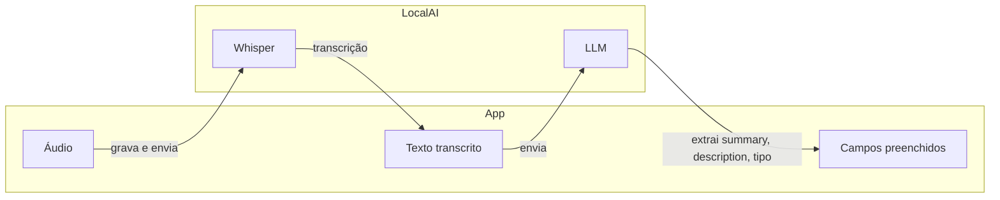
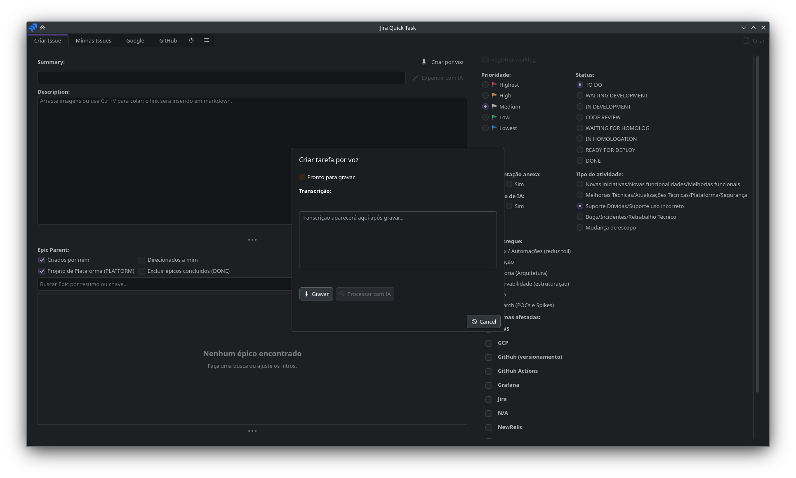

# Configurar entrada por voz (LocalAI)

A funcionalidade **Criar tarefa por voz** grava áudio no app e envia para o **LocalAI** no host. O LocalAI faz transcrição (Whisper) e processamento de texto (LLM) para preencher Summary, Description e Tipo de atividade.

**Conteúdo:** [Arquitetura](#arquitetura) · [Instalar LocalAI](#1-instalar-o-localai-host) · [Modelos](#2-modelos-no-localai) · [Configuração](#3-configuração-no-app) · [Uso](#6-uso) · [Diagnóstico](#diagnóstico)

## Arquitetura



- **No app (Flatpak):** gravação de áudio (sounddevice + PortAudio) e cliente HTTP para `http://localhost:8080`.
- **No host:** LocalAI com Whisper (transcrição) e LLM (ex.: qwen2.5:3b).

O app **não** embute modelos de ML; tudo roda no LocalAI no host.

## 1. Instalar o LocalAI (host)

### Docker (recomendado)

Para **GPU NVIDIA CUDA**, use o guia [LocalAI com NVIDIA CUDA via Docker](localai-docker-nvidia-setup.md).

```bash
mkdir -p .localai-models
docker compose -f docker-compose.localai.yml up -d
```

Para **CPU apenas**, edite `docker-compose.localai.yml`: use `image: localai/localai:latest` e remova o bloco `deploy` (GPU).

### Verificar

```bash
curl http://localhost:8080/v1/models
```

Se retornar JSON, o LocalAI está ativo.

## 2. Modelos no LocalAI

O app usa a API OpenAI-compatível:

| Uso | Endpoint | Modelo (exemplo) |
|-----|----------|------------------|
| Transcrição | `POST /v1/audio/transcriptions` | `whisper-1` |
| Extração LLM | `POST /v1/chat/completions` | `qwen2.5:3b` |

Baixe e configure os modelos conforme a [documentação do LocalAI](https://localai.io/getting-started/models/). Sugestão para ~6GB VRAM: Whisper + qwen2.5:3b.

## 3. Configuração no app

No **config.json** ou em **Configurações → Entrada por voz**:

| Campo | Descrição | Default |
|-------|-----------|---------|
| `localai_base_url` | URL do LocalAI | `http://localhost:8080` |
| `localai_whisper_model` | Modelo de transcrição | `whisper-1` |
| `localai_llm_model` | Modelo para extrair campos | `qwen2.5:3b` |
| `localai_task_system_prompt` | Pré-prompt para extração (summary, description, tipo). Define estrutura da description em Markdown | — |
| `localai_comment_improvement_prompt` | Pré-prompt para **Melhorar com IA** em comentários | — |
| `enabled` | Ativa entrada por voz e atalho | `false` |
| `language` | Idioma da transcrição | `pt` |
| `max_recording_seconds` | Tempo máximo de gravação | `120` |
| `keyboard_shortcut` | Atalho de teclado | `Ctrl+Shift+V` |
| `auto_process_after_stop` | Processar automaticamente ao parar gravação | `false` |
| `microphone_device` | Dispositivo de microfone | `default` |

Os pré-prompts são lidos do config em cada pedido; alterações salvas valem no próximo uso.

## 4. Flatpak: permissões

O manifest já inclui `--share=network` e `--socket=pulseaudio`. Não há modelos de ML no Flatpak.

## 5. Quando a entrada por voz fica disponível

O bloco **Entrada por voz** e o botão **Criar por voz** só ficam habilitados quando:

1. Dependências de **áudio** estão disponíveis (sounddevice, PortAudio).
2. O app consegue falar com o **LocalAI** em `localai_base_url` (`GET /v1/models` com sucesso).

## Diagnóstico

Se a opção de voz estiver desabilitada:

1. **Rode com debug:** `flatpak run org.kde.jira-quick-task --debug` ou `make run-debug`.
2. Abra **Configuração** e verifique o bloco **Entrada por voz**.
3. **Log de debug:** `LocalAIClient` grava URL e erro. Logs em `~/.config/jira-quick-task/debug.log` (Flatpak) ou saída do terminal.
4. **Mensagens comuns:**
   - `Connection refused` → LocalAI não está rodando ou não está em 8080.
   - `timed out` → Firewall ou rede bloqueando.
   - **Flatpak + localhost:** `127.0.0.1` pode referir-se ao loopback do sandbox. Use o **IP da máquina** (ex.: `ip -4 addr`), configure o LocalAI para escutar em `0.0.0.0:8080` e use `http://192.168.x.x:8080` nas configurações do app.

## 6. Uso



1. Na aba **Criar Issue**, use o botão **Criar por voz** (microfone) ou o atalho (ex.: **Ctrl+Shift+V**).
2. **Gravar** para capturar áudio; **Parar** para enviar ao LocalAI e transcrever.
3. A transcrição aparece na caixa de texto; edite se necessário.
4. **Processar com IA** envia o texto ao LLM e preenche Summary, Description e Tipo de atividade.
5. Revise e clique em **Criar** para enviar ao Jira.

## Referências

- [LocalAI com NVIDIA CUDA via Docker](localai-docker-nvidia-setup.md)
- [LocalAI](https://localai.io/) — [Docker](https://localai.io/installation/docker/), [Audio-to-text](https://localai.io/features/audio-to-text/), [Text generation](https://localai.io/features/text-generation/)
- [SoundDevice](https://python-sounddevice.readthedocs.io/)
